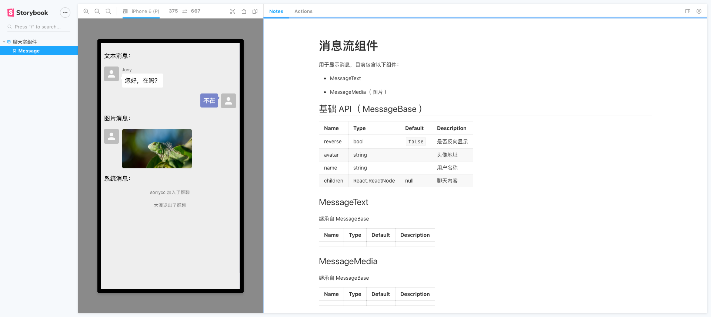

# IM

聊天室 Demo，[教程](./docs/tutorial.md)

## 特性

- [x] 基于 TS，Lerna + monorepo 开发
- [x] 基于 React FC，useReducer + useContext 数据流管理
- [x] 基于 material-ui 二次封装，并采用 storybook 维护文档的组件库
- [x] 基于 socket.io 的聊天功能
- [x] 标配 Git 提交 Eslint 检测、Commit 规范

## 预览

APP


组件库文档



## 开始

依赖安装

```bash
yarn lerna bootstrap
yarn lerna link
```

组件库开发

```bash
yarn ui
```

启动 Client 端

```bash
yarn app
```

启动 Server 端

```bash
yarn server
```

## 目录说明


客户端 APP

```bash
├── App.tsx
├── assets
├── container
│   ├── chat
│   │   ├── Chat.tsx # 聊天室主逻辑
│   │   ├── Emoji.tsx # 表情功能
│   │   ├── Extra.tsx # 扩展功能，如相册等
│   │   ├── Header.tsx # 顶部通栏
│   │   ├── Message.tsx # 消息流
│   │   ├── MessageItem.tsx # 消息流
│   │   ├── Tool.tsx # 工具栏，如发送语音、发送文本、表情等
│   │   ├── emojis.ts # 表情集合
│   │   ├── index.tsx
│   │   └── store.tsx # 聊天室状态流
│   └── index.ts
├── index.tsx
└── store # 后续存放 APP 全局 Store，比如用户信息
    ├── ContextStore.tsx
    ├── index.tsx
    ├── reducers
    │   ├── constants.ts
    │   ├── index.ts
    │   └── user.ts
    ├── useGlobalStore.tsx
    └── useStore.tsx
```
